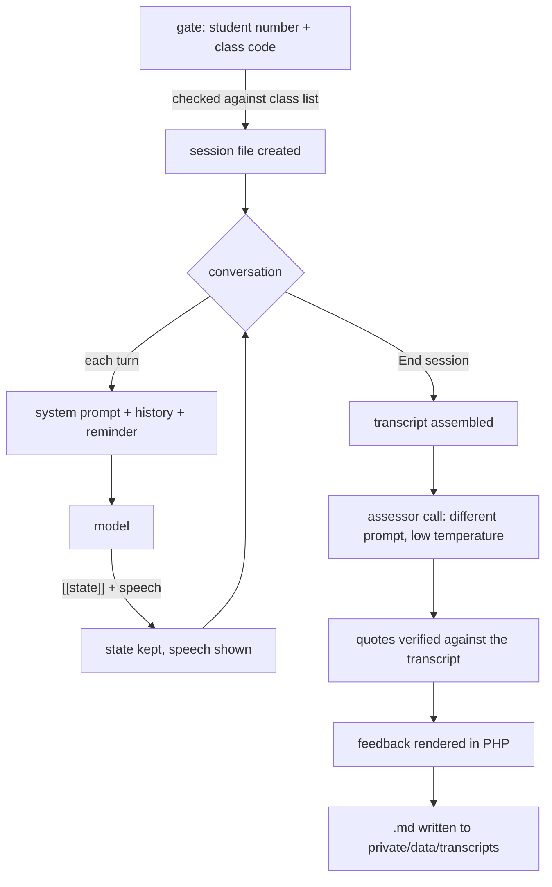

# Architecture

Two model calls, one hidden state block, and no database. That is the whole
thing. This document explains why each of those is the way it is.

## The shape of a session



## Two calls, not one

The client and the assessor are different jobs with contradictory instructions.
One says *never break character, you do not know statistics*; the other says
*you are an experienced consultant, judge this transcript*. Asking a single
conversation to do both is what made the earlier version skip its evaluation:
the character had no reliable way to know the session was over, and every
instruction to grade competed with the instruction to stay in role.

Here the application makes the second call. `cc_chat_end()` in
`private/src/chat.php` runs the assessor over the finished transcript with a
fresh system prompt at a low temperature. It cannot be forgotten, because
nothing is being asked to remember it.

If the assessor call fails, the session still closes and the transcript is
still written, with a note. Losing the conversation would be much worse than
losing the feedback.

## The hidden state block

Every reply from the client begins with one line the student never sees:

```
[[stage=2; mood=1; open=comparability]]

Sorry, I'm not sure I follow. Could you say that in plain terms?
```

`private/src/persona.php` strips it before the text reaches the browser and
keeps the values on the session. Three things depend on it.

**It anchors identity.** Generation starts inside the bookkeeping rather than
inside "helpful assistant", which is where an unprompted model wants to be.

**It makes mood mechanical.** The number is committed before the prose, so the
sentence that follows has to match it. Adjectives in a prompt do not survive
contact with a model trained to be agreeable; a number does.

**It gives the feedback a trace.** The mood at each turn is recorded, so the
report can show where the client's patience moved and what was said just
before. That is free — the numbers were already there.

Parsing is deliberately forgiving. A missing state line keeps the previous
state and shows the text; an unparseable one changes nothing. A malformed
bookkeeping line should never cost a student their turn.

## Why mood moves one step at a time

`cc_parse_reply()` clamps any change to ±1 per turn, and the prompt asks for the
same thing. Both are needed, because the prompt alone does not hold: told to
become impatient, models over-read the instruction and jump straight to the
top. In testing, an adversarial consultant took the client from 2 to 5 in a
single turn and she walked out at turn three, which reads as caricature rather
than as a client. Enforced in code, reaching the point of leaving takes five
poor turns, and a competent consultant keeps her at zero indefinitely.

At mood 5 she says she is leaving and the session stops accepting messages. The
consequence should be that the meeting is over, not that the student keeps
talking to someone who has said goodbye.

All of this disappears when `with_frustration` is `0`: no mood in the state
line, no escalation rules in the prompt, no trace in the report, no walking out.

## Staying in role

Four mechanisms, because no single one was enough.

1. **A reminder on every turn.** `cc_turn_reminder()` is appended as the last
   message before generation. By turn thirty the system prompt is a long way
   back and the most recent thing in context is a student asking a technical
   question.
2. **A repertoire of deflections.** Asked what she thinks, she has five
   in-character moves — plead ignorance, misremember, ask for it more simply,
   quote a colleague, worry about her timeline — so she is never cornered into
   either answering or breaking.
3. **Specific misconceptions.** When she does talk statistics she is wrong in
   listed, deliberate ways. This converts the model's excess knowledge into the
   exercise's best material: the student has to notice and repair it.
4. **A stage machine.** Five stages of a consultation give her something to do
   other than be helpful, which is the deepest cause of drift.

## Storage

Files, no database. Sessions are JSON at
`private/data/sessions/<student>_<sid>.json`, so counting a student's sessions
is a glob and needs no index. Transcripts are Markdown at
`private/data/transcripts/<date>_s<student>_<persona>_<id>.md`.

The student number is in the filename and never in the document, so preparing a
transcript for class use is a copy and a rename rather than a read-through.

Writes go through `cc_write_atomic()` — write to a temporary name, then rename —
so a reader never sees half a file.

## Provider independence

`private/src/llm.php` is the only file that knows a model provider exists. It
speaks the OpenAI chat-completions protocol, which OpenRouter, SURF AI-hub,
Scaleway, Mistral and the rest all implement. Moving between them is two lines
of `config.php`.

It handles three failures that matter in practice: rate limits are retried with
backoff; authentication errors are not, because they will not fix themselves;
and an empty reply with `finish_reason: length` doubles the token budget rather
than retrying identically. That last one is specific to reasoning models, which
spend the budget thinking before they write and return nothing at all if it runs
out.

## Trust boundaries

The browser is told nothing it should not know. The system prompt, the hidden
state and the persona definition never leave the server; the conversation lives
in a session file and the browser sends only the next message. A student who
opens the network tab sees their own words and the client's replies.

The one piece of user input that reaches a filesystem path is the student
number, and it is reduced to digits before it gets there. Session ids must match
`[a-f0-9]{16,64}` before they are used to build a path.
